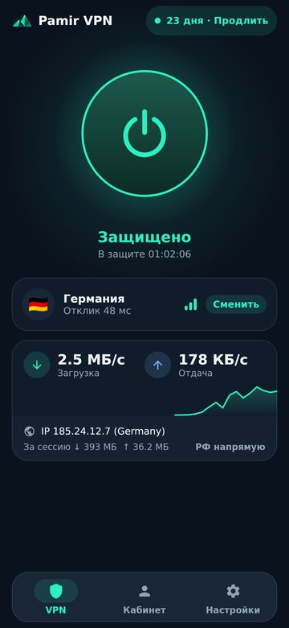
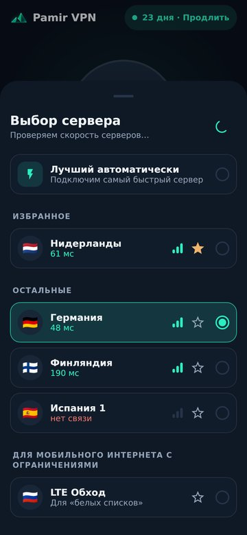
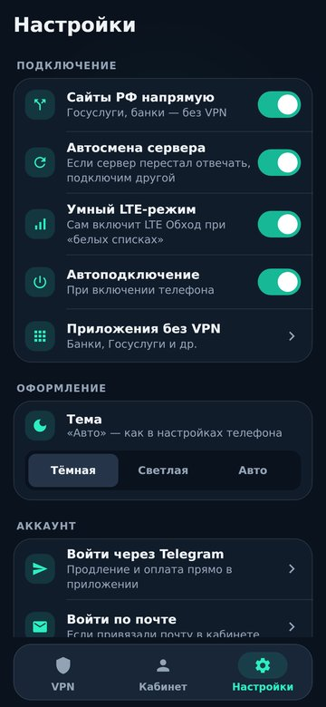

# Pamir VPN

**Защищённый интернет в одно касание — приложение для Android и Android TV**

### [⬇️ Скачать приложение](https://github.com/Said240705/pamir-vpn-android/releases/latest/download/pamir-vpn-universal.apk)

Файл <code>pamir-vpn-universal.apk</code> подходит для всех телефонов и телевизоров на Android ·
<a href="https://app.pamirlink.ru">Личный кабинет</a> ·
<a href="https://t.me/pamirlink_bot">Telegram-бот</a>

 

&nbsp;
&nbsp;
&nbsp;

---

## ✨ Возможности

| | |
|---|---|
| ⚡ **Одна кнопка** | Подключение в одно касание, без настроек и ручного ввода конфигураций |
| 🔑 **Вход через Telegram или почту** | Подписка подключается сама — ссылки копировать не нужно |
| 🌍 **Серверы в Европе** | Приложение показывает отклик каждого сервера и само выбирает самый быстрый |
| 📶 **Работает на мобильном интернете** | Отдельные серверы для сетей с ограничениями и «умный режим», который включает их сам |
| 🏦 **Сайты РФ напрямую** | Госуслуги и банки открываются без шифрования, всё остальное — под защитой |
| 📱 **Приложения без VPN** | Можно выбрать программы, которые ходят в интернет напрямую |
| 💳 **Оплата внутри приложения** | Продление через СБП, карту или с баланса, промокоды, бесплатный пробный период |
| 🔁 **Автосмена сервера** | Если сервер перестал отвечать, приложение переключится на другой |
| 📺 **Android TV** | Отдельный интерфейс для пульта, вход по QR-коду, автозапуск вместе с телевизором |
| 🔔 **Плитка в шторке и виджет** | Включить и выключить защиту можно, не открывая приложение |

## 🚀 Как начать

1. **Скачайте** [`pamir-vpn-universal.apk`](https://github.com/Said240705/pamir-vpn-android/releases/latest/download/pamir-vpn-universal.apk) и установите его.
2. **Войдите** через Telegram или по почте — подписка и серверы загрузятся сами.
3. **Нажмите большую кнопку** — готово, интернет под защитой.

Нет подписки? В приложении можно оформить бесплатный пробный период или выбрать тариф.

## 🛡 Почему Android предупреждает при установке

Pamir VPN устанавливается из файла, а не из Google Play, поэтому Android и Play Защита могут показать предупреждение «Приложение из неизвестного источника». Это стандартное сообщение для любых приложений не из магазина.

Чтобы установить: нажмите **«Всё равно установить»** (или **«Подробнее» → «Всё равно установить»**). Обновления потом приходят прямо в приложении.

Исходный код приложения открыт — он целиком находится в этом репозитории.

## 💬 Поддержка

- Telegram-бот: [@pamirlink_bot](https://t.me/pamirlink_bot)
- Личный кабинет: [app.pamirlink.ru](https://app.pamirlink.ru)
- В приложении: **Настройки → Поддержка** или **Сообщить о проблеме**

---

<b>🛠 Для разработчиков</b>

 

Pamir VPN основан на открытом клиенте [v2rayNG](https://github.com/2dust/v2rayNG) и ядре [Xray](https://github.com/XTLS/Xray-core).

- `V2rayNG/` — Android-проект v2rayNG (Kotlin, Gradle).
- `pamir/src/` — интерфейс Pamir на Jetpack Compose: главный экран, кабинет, оплата, настройки, ТВ.
- `pamir/brand.py` — превращает v2rayNG в Pamir VPN: название, иконки, пакет `ru.pamirlink.vpn`, подключение экранов Pamir.
- `pamir/server/` — патчи для сервера кабинета и бота.
- `.github/workflows/pamir-build.yml` — сборка и публикация релиза (кнопка **Run workflow**: версия, тестовая сборка, важное обновление).
- `.github/workflows/pamir-emulator.yml` — проверка готового APK на эмуляторе Android.

Сборка вручную повторяет шаги из `pamir-build.yml`: подготовить ядро (`AndroidLibXrayLite`, `hev-socks5-tunnel`), запустить `python3 pamir/brand.py`, затем `./gradlew assemblePlaystoreRelease` в папке `V2rayNG`.

## 📄 Лицензия

Распространяется по лицензии [GNU GPL v3](LICENSE), как и исходный проект [v2rayNG](https://github.com/2dust/v2rayNG) (© 2dust и участники проекта).
